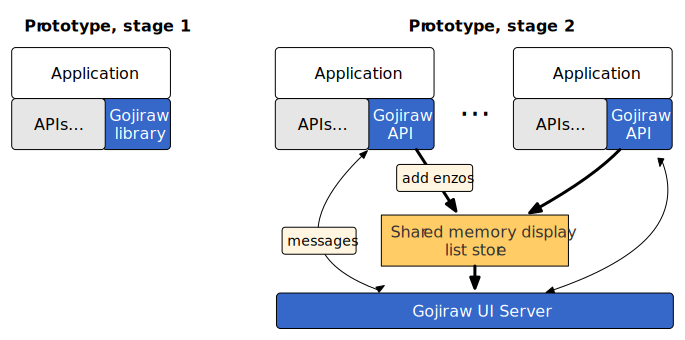

# Introduction
This document proposes the Gojiraw API. Gojiraw is a fun portmanteau
of *Go* *Ji*ffy-fast *Raw* draw. Gojiraw is intended to be a general
purpose (primarily) 2D graphics API that could support a wide range of
customers such as Blink, Mojo applications or the Plan9 `devdraw`
interface.

There are multiple possibilities for how Gojiraw can fit into a larger
system.

* Client is a simple Go program, the server is a binary derived from
our existing codebase. The client/server split serves to validate
architectual choices prior to the following applications where
client/server operation is required.

* Client is a [Plan 9 Port](http://swtch.com/plan9port/) application
and server is a replacement for P9P's
[devdraw](http://swtch.com/plan9port/man/man1/devdraw.html).

* Gojiraw is a Mojo server/service sourcing events and sinking Gojiraw
display lists via Mojo APIs. In this context, Blink could use Gojiraw
as as UI process.

Gojiraw requires an underlying system that can permit the allocation
of surfaces, render an OpenGL command and source a stream of events.
(With the movement away from OpenGL to Metal, Vulkan, DirectX, it
seems prudent to modify the architecture to assume that Gojiraw will
be structured to support multiple different system GPU
interfaces.)

Gojiraw provides its customers with an API similar to the
JavaScript canvas API with the following extensions:

*	simple provisions for efficient drawing of text with a bounded number of styles
*	bounding box calculations
*	pan/zoom regions
*	mutable replayable groups

# Literature

*survey if necessary*

# Basic Concepts
I introduce the following basic objects and actions.

*  `Image` a rectangular expanse of pixels that can
be the target of rasterization. GPUs render to `Image` instances.

* `Screen` a single panel, CRT, etc. An `Image` can be scanned out
onto a `Screen` by a display controller. Overlay capability permits
multiple images scanned out on a single screen. (I argue that a
(clipped) view of the same Image can be displayed on several screens
but not span multiple screens.)

*  `Display` the union of all `Screen`s that we want to display
to.

*  we *present* an `Image` to a `Display`. This action signifies
that scan out of the `Image` should begin at the end of the 
next vblank. 

*  `Enso` a single simple drawable. A stroke or member in a display
list.

*  `Inkings` a bundle of Ensos that can be transformed and drawn
as a unit. Inkings are recursive.

* `Glyph` is a number specifying a single glyph outline to draw.

# Principles
Core principles of the API

*  *lazy rasterization*: all rasterization in Gojiraw can be deferred.

*  *non-blocking*: no Gojiraw API blocks (waiting on the display controller
or GPU). If the result is not immediately available, a promise it provided
in its place.

# Version History

1. first draft. API provides Display, Screen, Image infrastructure and
drawing only of text and bitmaps to rectangular regions. Overlays
remain imprecise.

